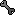
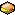
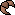
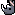

# Forumoji Waitlist

The following is a list of emojis that have been contributed to the Forumoji project, but have yet to be added to the [GitHub repository](https://github.com/vercte/forumoji) or uploaded to the official Cubeupload account.

As of **October 16th, 2024,** the backlog contains **73 emojis,** dating back to **July 4th, 2024.**

The "URL" column contains hyperlinks to each emoji on Cubeupload, enabling these emojis to be used on the Scratch Forums.

|Codepoint|Emoji|Name|URL|Contributor(s)|Date Contributed|
|:-------:|:---:|:---|:-:|:-------------|:---------------|
|`1F6C2`||Passport Control|[🔗](https://u.cubeupload.com/CocoTheMii/1f6c2.png)|Scratch137, floppasyay|2024-10-16|
|`1F9BA`||Safety Vest|[🔗](https://u.cubeupload.com/CocoTheMii/1f9ba.png)|Scratch137|2024-10-16|
|`1F39E`||Film Frames|[🔗](https://u.cubeupload.com/CocoTheMii/1f39e.png)|Scratch137|2024-10-16|
|`1FAAC`||Hamsa|[🔗](https://u.cubeupload.com/CocoTheMii/1faac.png)|Scratch137|2024-10-16|
|`1F6C3`||Customs *|[🔗](https://u.cubeupload.com/CocoTheMii/1f6c3.png)|floppasyay|2024-10-16|
|`1F512`||Locked *|[🔗](https://u.cubeupload.com/CocoTheMii/1f512.png)|Scratch137|2024-10-16|
|`1F513`||Unlocked *|[🔗](https://u.cubeupload.com/CocoTheMii/1f513.png)|Scratch137|2024-10-16|
|`1F510`||Locked with Key *|[🔗](https://u.cubeupload.com/CocoTheMii/1f510.png)|greg1234567890f, Scratch137|2024-10-16|
|`1F50F`||Locked with Pen *|[🔗](https://u.cubeupload.com/CocoTheMii/1f50f.png)|greg1234567890f, Scratch137|2024-10-16|
|`1F511`||Key *|[🔗](https://u.cubeupload.com/CocoTheMii/1f511.png)|greg1234567890f|2024-10-16|
|`1FA9F`||Window *|[🔗](https://u.cubeupload.com/CocoTheMii/1fa9f.png)|ZanterZlox, Scratch137|2024-10-16|
|`1F453`||Glasses|[🔗](https://u.cubeupload.com/Octostomp/pixilframe09.png)|co0lcr34t10ns|2024-10-11|
|`1F3DC`||Desert|[🔗](https://u.cubeupload.com/popularknight/pixilframe042.png)|floppasyay|2024-09-21|
|`1F4B8`||Money with Wings|[🔗](https://u.cubeupload.com/popularknight/pixilframe043.png)|floppasyay|2024-09-21|
|`1F3D4`||Snowcapped Mountain|[🔗](https://u.cubeupload.com/popularknight/pixilframe037.png)|floppasyay|2024-09-21|
|`1F5FB`||Mount Fuji|[🔗](https://u.cubeupload.com/popularknight/pixilframe038.png)|floppasyay|2024-09-21|
|`1F3D5`||Camping|[🔗](https://u.cubeupload.com/popularknight/pixilframe039.png)|floppasyay|2024-09-21|
|`1F3D6`||Beach with Umbrella|[🔗](https://u.cubeupload.com/popularknight/pixilframe040.png)|floppasyay|2024-09-21|
|`1F4B3`||Credit Card|[🔗](https://u.cubeupload.com/popularknight/pixilframe045.png)|floppasyay|2024-09-21|
|`1F527`||Wrench|[🔗](https://u.cubeupload.com/popularknight/pixilframe048.png)|floppasyay|2024-09-21|
|`1F6A8`||Police Car Light|[🔗](https://u.cubeupload.com/popularknight/pixilframe049.png)|floppasyay|2024-09-21|
|`1F952`||Cucumber|[🔗](https://u.cubeupload.com/JakubMzTrencina/FcUDAf.png)|JakubMzTrencina|2024-09-06|
|`1F58C`||Paintbrush|[🔗](https://u.cubeupload.com/JakubMzTrencina/Ayz7bt.png)|JakubMzTrencina|2024-09-06|
|`1F4FC`||Videocassette|[🔗](https://u.cubeupload.com/JakubMzTrencina/MKX8Ug.png)|JakubMzTrencina|2024-|
|`1F432`||Dragon Face|[🔗](https://u.cubeupload.com/teamsonic2011/1f432.png)|teamsonic2011|2024-09-05|
|`1F371`||Bento Box|[🔗](https://u.cubeupload.com/popularknight/pixilframe032.png)|floppasyay|2024-09-05|
|`1FAD3`||Flatbread|[🔗](https://u.cubeupload.com/popularknight/pixilframe031.png)|floppasyay|2024-09-05|
|`1F96A`||Sandwich|[🔗](https://u.cubeupload.com/popularknight/pixilframe033.png)|floppasyay|2024-09-05|
|`1F37C`||Baby Bottle|[🔗](https://u.cubeupload.com/popularknight/pixilframe030.png)|floppasyay|2024-09-05|
|`1F684`||High-Speed Train|[🔗](https://u.cubeupload.com/popularknight/pixilframe034.png)|floppasyay|2024-09-05|
|`1F40D`||Snake|[🔗](https://u.cubeupload.com/JakubMzTrencina/QdyQCL.png)|JakubMzTrencina|2024-09-05|
|`1F31F`||Glowing Star|[🔗](https://u.cubeupload.com/JakubMzTrencina/q7gyCv.png)|JakubMzTrencina|2024-09-05|
|`1F4F0`||Newspaper|[🔗](https://u.cubeupload.com/CocoTheMii/1f4f0.png)|ilovestories|2024-09-03|
|`1F5DE`||Rolled-Up Newspaper|[🔗](https://u.cubeupload.com/CocoTheMii/1f5de.png)|ilovestories|2024-09-03|
|`1FA79`||Adhesive Bandage|[🔗](https://u.cubeupload.com/CocoTheMii/1fa79.png)|ilovestories|2024-09-03|
|`1FA9C`||Ladder|[🔗](https://u.cubeupload.com/CocoTheMii/1fa9c.png)|ilovestories|2024-08-10|
|`1F516`||Bookmark|[🔗](https://u.cubeupload.com/CocoTheMii/1f516.png)|ilovestories|2024-09-03|
|`1F9BB`||Ear with Hearing Aid|[🔗](https://u.cubeupload.com/popularknight/d8apixilframe05.png)|floppasyay|2024-09-02|
|`1F9D1 200D 1F384`||Mx. Claus|[🔗](https://u.cubeupload.com/GreyFox/mxclaus.png)|gplb2718|2024-09-02|
|`1F936`||Mrs. Claus|[🔗](https://u.cubeupload.com/GreyFox/msclaus.png)|gplb2718|2024-09-02|
|`1F385`||Santa Claus|[🔗](https://u.cubeupload.com/GreyFox/santa.png)|gplb2718|2024-09-02|
|`1F96B`||Canned Food|[🔗](https://u.cubeupload.com/GreyFox/soup.png)|gplb2718|2024-09-01|
|`1F96C`||Leafy Green|[🔗](https://u.cubeupload.com/GreyFox/kale.png)|gplb2718|2024-09-01|
|`1F950`||Croissant|[🔗](https://u.cubeupload.com/GreyFox/crossant.png)|gplb2718|2024-09-01|
|`1F3A2`||Roller Coaster|[🔗](https://u.cubeupload.com/GreyFox/coaster.png)|gplb2718|2024-09-01|
|`262A`||Star and Crescent *|[🔗](https://u.cubeupload.com/RoboChemist/U262A.png)|RobotChickens|2024-08-30|
|`262F`||Yin Yang *|[🔗](https://u.cubeupload.com/RoboChemist/U262F.png)|RobotChickens|2024-08-30|
|`2626`||Orthodox Cross *|[🔗](https://u.cubeupload.com/RoboChemist/U2626V2.png)|RobotChickens|2024-08-30|
|`271D`||Latin Cross *|[🔗](https://u.cubeupload.com/RoboChemist/U271D.png)|RobotChickens|2024-08-30|
|`2638`||Wheel of Dharma *|[🔗](https://u.cubeupload.com/RoboChemist/U2638.png)|RobotChickens|2024-08-30|
|`1F549`||Om Symbol *|[🔗](https://u.cubeupload.com/RoboChemist/U1F549.png)|RobotChickens|2024-08-30|
|`269B`||Atom Symbol *|[🔗](https://u.cubeupload.com/RoboChemist/U269B.png)|RobotChickens|2024-08-30|
|`1F52F`||Dotted Six-Pointed Star|[🔗](https://u.cubeupload.com/RoboChemist/U1F52F.png)|RobotChickens|2024-08-30|
|`2721`||Star of David *|[🔗](https://u.cubeupload.com/RoboChemist/U2721.png)|RobotChickens|2024-08-30|
|`1F330`||Chestnut|[🔗](https://u.cubeupload.com/RoboChemist/U1F330.png)|RobotChickens|2024-08-29|
|`1F9C7`||Waffle|[🔗](https://u.cubeupload.com/RoboChemist/U1F37F.png)|RobotChickens|2024-08-29|
|`2623`||Biohazard|[🔗](https://u.cubeupload.com/RoboChemist/U2623.png)|RobotChickens|2024-08-29|
|`1F531`||Trident|[🔗](https://u.cubeupload.com/RoboChemist/U1F531V2.png)|RobotChickens|2024-08-29|
|`269C`||Fleur-de-lis|[🔗](https://u.cubeupload.com/RoboChemist/U269CV2.png)|RobotChickens|2024-08-29|
|`267B`||Recycling|[🔗](https://u.cubeupload.com/RoboChemist/U267B.png)|RobotChickens|2024-08-29|
|`1F962`||Chopsticks|[🔗](https://u.cubeupload.com/GreyFox/pixilframe02.png)|gplb2718|2024-08-29|
|`1FA90`||Ringed Planet|[🔗](https://u.cubeupload.com/GreyFox/pixilframe03.png)|gplb2718|2024-08-29|
|`1F386`||Fireworks|[🔗](https://u.cubeupload.com/GreyFox/pixilframe04.png)|gplb2718|2024-08-29|
|`1F9EE`||Abacus|[🔗](https://u.cubeupload.com/GreyFox/pixilframe05.png)|gplb2718|2024-08-29|
|`1F954`||Potato|[🔗](https://u.cubeupload.com/GreyFox/pixilframe0.png)|gplb2718|2024-08-29|
|`1F33D`||Ear of Corn|[🔗](https://u.cubeupload.com/GreyFox/pixilframe01.png)|gplb2718|2024-08-29|
|`1F6AD`||No Smoking|[🔗](https://u.cubeupload.com/greg1234567890f/nosmoking.png)|tarsovbak, greg1234567890f|2024-08-10|
|`1FAE7`||Bubbles|[🔗](https://u.cubeupload.com/greg1234567890f/bubbles.png)|greg1234567890f|2024-08-10|
|`1F4E6`||Package|[🔗](https://u.cubeupload.com/greg1234567890f/package.png)|greg1234567890f|2024-08-10|
|`1F98F`||Rhinoceros|[🔗](https://u.cubeupload.com/popularknight/pixilframe027.png)|floppasyay|2024-07-16|
|`1F995`||Sauropod|[🔗](https://u.cubeupload.com/popularknight/pixilframe028.png)|floppasyay|2024-07-16|
|`1F4BB`||Laptop *|[🔗](https://u.cubeupload.com/CocoTheMii/1f4bb.png)|mybearworld|2024-07-04|
|`1F5A5`||Desktop Computer *|[🔗](https://u.cubeupload.com/CocoTheMii/1f5a5.png)|mybearworld|2024-07-04|
<!-- |`XXXXX`||Name|[🔗](URL)|Author|YYYY-MM-DD| -->

* Updated design for an emoji already present in the main Forumoji repository. This emoji is not included in the waitlist `emoji.json`; if the new emoji has a different author than the old one, its entry will need to be updated manually.

## Adding to Forumoji
Within this repository are some files that have been provided to simplify the process of adding the new emojis to the main repository.

Below is a list of important assets, as well as an explanation of how to implement each.

* `emoji.json` is a JSON object containing codepoints and authors for every emoji on this list, excluding updated designs for emojis that have been contributed before.
  * Append the contents of this file to `assets/emoji.json` on the [`main`](https://github.com/vercte/forumoji) branch
  * Copy the contents of the combined `assets/emoji.json` file into `assets/emoji.js` on the [`gh-pages`](https://github.com/vercte/forumoji/tree/gh-pages) branch
* `emoji/15x15` contains every emoji on this list in PNG format, ready to be dropped in to the main repository as-is.
  * Copy everything in this folder into `assets/emoji/15x15` on the [`main`](https://github.com/vercte/forumoji) and [`gh-pages`](https://github.com/vercte/forumoji/tree/gh-pages) branches

Beyond just copying these files over, also take note of any emojis marked with an asterisk * in the waitlist above. These are updates to existing emojis, and adding these may involve updating the listed authors in `assets/emoji.json`.
