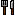
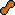

# Forumoji Waitlist

The following is a list of emojis that have been contributed to the Forumoji project, but have yet to be added to the [GitHub repository](https://github.com/vercte/forumoji) or uploaded to the official Cubeupload account.

As of May 30th, 2024, the backlog consists of 78 emojis, going back to January 3rd, 2024.

The "URL" column contains hyperlinks to each emoji on Cubeupload, enabling these emojis to be used on the Scratch Forums.

|Codepoint|Emoji|Name|URL|Contributor|Date Contributed|
|:-------:|:---:|:---|:-:|:----------|:---------------|
|`1F442`||Ear|[🔗](https://u.cubeupload.com/Famus/pixilframe0.png)|VeryFamus|2024-05-30|
|`1F44A`||Oncoming Fist|[🔗](https://u.cubeupload.com/Famus/pixilartdrawing.png)|VeryFamus|2024-05-30|
|`1F636 200D 1F32B FE0F`||Face in Clouds *|[🔗](https://u.cubeupload.com/jmdzti_/faceinclouds.png)|jmdzti_0-0|2024-05-25|
|`1F698`||Oncoming Automobile|[🔗](https://u.cubeupload.com/popularknight/4apixilframe020.png)|floppasyay|2024-05-23|
|`1F32A`||Tornado|[🔗](https://u.cubeupload.com/jmdzti_/descarga81.png)|gem1001|2024-05-23|
|`1F9E0`||Brain|[🔗](https://u.cubeupload.com/notwait/brain.png)|notwait|2024-05-23|
|`1F366`||Soft Ice Cream|[🔗](https://u.cubeupload.com/jmdzti_/350download.png)|gem1001|2024-05-22|
|`2747`||Sparkle|[🔗](https://u.cubeupload.com/CocoTheMii/2747.png)|Scratch137|2024-05-21|
|`1F966`||Broccoli|[🔗](https://u.cubeupload.com/CocoTheMii/1f966.png)|gem1001|2024-05-21|
|`1F9D1 200D 1F9B2`||Person: Bald|[🔗](https://u.cubeupload.com/CocoTheMii/1f9d1200d1f9b2.png)|Scratch137|2024-05-12|
|`1F9D4`||Person: Beard|[🔗](https://u.cubeupload.com/CocoTheMii/1f9d4.png)|Scratch137|2024-05-12|
|`1F9D1 200D 1F9B0`||Person: Red Hair|[🔗](https://u.cubeupload.com/CocoTheMii/1f9d1200d1f9b0.png)|Scratch137|2024-05-12|
|`1F471`||Person: Blond Hair|[🔗](https://u.cubeupload.com/CocoTheMii/1f471.png)|Scratch137|2024-05-12|
|`1F9D1 200D 1F9B3`||Person: White Hair|[🔗](https://u.cubeupload.com/CocoTheMii/1f9d1200d1f9b3.png)|Scratch137|2024-05-12|
|`1F469 200D 1F9B2`||Woman: Bald|[🔗](https://u.cubeupload.com/CocoTheMii/1f469200d1f9b2.png)|Scratch137|2024-05-12|
|`1F9D4 200D 2640 FE0F`||Woman: Beard|[🔗](https://u.cubeupload.com/CocoTheMii/1f9d4200d2640fe0f.png)|Scratch137|2024-05-12|
|`1F469 200D 1F9B0`||Woman: Red Hair|[🔗](https://u.cubeupload.com/CocoTheMii/1f469200d1f9b0.png)|Scratch137|2024-05-12|
|`1F471 200D 2640 FE0F`||Woman: Blond Hair|[🔗](https://u.cubeupload.com/CocoTheMii/1f471200d2640fe0f.png)|Scratch137|2024-05-12|
|`1F469 200D 1F9B3`||Woman: White Hair|[🔗](https://u.cubeupload.com/CocoTheMii/1f469200d1f9b3.png)|Scratch137|2024-05-12|
|`1F468 200D 1F9B2`||Man: Bald|[🔗](https://u.cubeupload.com/CocoTheMii/1f468200d1f9b2.png)|Scratch137|2024-05-12|
|`1F9D4 200D 2642 FE0F`||Man: Beard|[🔗](https://u.cubeupload.com/CocoTheMii/1f9d4200d2642fe0f.png)|Scratch137|2024-05-12|
|`1F468 200D 1F9B0`||Man: Red Hair|[🔗](https://u.cubeupload.com/CocoTheMii/1f468200d1f9b0.png)|Scratch137|2024-05-12|
|`1F471 200D 2642 FE0F`||Man: Blond Hair|[🔗](https://u.cubeupload.com/CocoTheMii/1f471200d2642fe0f.png)|Scratch137|2024-05-12|
|`1F468 200D 1F9B3`||Man: White Hair|[🔗](https://u.cubeupload.com/CocoTheMii/1f468200d1f9b3.png)|Scratch137|2024-05-12|
|`2699`||Gear|[🔗](https://u.cubeupload.com/popularknight/pixilframe05.png)|floppasyay|2024-05-11|
|`1FAAF`||Khanda|[🔗](https://u.cubeupload.com/popularknight/pixilframe06.png)|floppasyay|2024-05-11|
|`1F6E3`||Motorway|[🔗](https://u.cubeupload.com/popularknight/pixilframe07.png)|floppasyay|2024-05-11|
|`26CF`||Pick|[🔗](https://u.cubeupload.com/popularknight/pixilframe015.png)|floppasyay|2024-05-11|
|`1F9D1 200D 1F680`||Astronaut|[🔗](https://u.cubeupload.com/popularknight/pixilframe09.png)|floppasyay|2024-05-11|
|`1F468 200D 1F680`||Man Astronaut|[🔗](https://u.cubeupload.com/popularknight/pixilframe013.png)|floppasyay|2024-05-11|
|`1F469 200D 1F680`||Woman Astronaut|[🔗](https://u.cubeupload.com/popularknight/pixilframe012.png)|floppasyay|2024-05-11|
|`1F54A`||Dove|[🔗](https://u.cubeupload.com/popularknight/pixilframe014.png)|floppasyay|2024-05-11|
|`269B`||Atom Symbol|[🔗](https://u.cubeupload.com/popularknight/pixilframe016.png)|floppasyay|2024-05-11|
|`1F3BE`||Tennis|[🔗](https://u.cubeupload.com/popularknight/pixilframe017.png)|floppasyay|2024-05-11|
|`1F397`||Reminder Ribbon|[🔗](https://u.cubeupload.com/popularknight/pixilframe018.png)|floppasyay|2024-05-11|
|`1F97D`||Goggles|[🔗](https://u.cubeupload.com/popularknight/pixilframe019.png)|floppasyay|2024-05-11|
|`2695`||Medical Symbol|[🔗](https://u.cubeupload.com/Octostomp/medicalsymbolfmji.png)|co0lcr34t10ns|2024-05-09
|`1F96E`||Moon Cake|[🔗](https://u.cubeupload.com/Octostomp/bettermooncake.png)|co0lcr34t10ns|2024-05-07
|`1F6C3`||Customs|[🔗](https://u.cubeupload.com/popularknight/customs.png)|floppasyay|2024-05-07
|`1F341`||Maple Leaf|[🔗](https://u.cubeupload.com/popularknight/mapleLeaf.png)|floppasyay|2024-05-07
|`1F985`||Eagle|[🔗](https://u.cubeupload.com/popularknight/eagle.png)|floppasyay|2024-05-07
|`1F575`||Detective|[🔗](https://u.cubeupload.com/popularknight/detective.png)|floppasyay|2024-05-07
|`1F9FC`||Soap|[🔗](https://u.cubeupload.com/greg1234567890f/soap.png)|greg1234567890f|2024-03-07
|`1F956`||Baguette Bread|[🔗](https://u.cubeupload.com/numbersaccepted/costume5.png)|quadruple_door|2024-03-05
|`1F32B`||Fog|[🔗](https://u.cubeupload.com/numbersaccepted/costume6.png)|quadruple_door|2024-03-05
|`1F6BD`||Toilet|[🔗](https://u.cubeupload.com/numbersaccepted/costume7.png)|quadruple_door|2024-03-05
|`1F374`||Fork and Knife|[🔗](https://u.cubeupload.com/numbersaccepted/costume1.png)|quadruple_door|2024-03-05
|`1F95B`||Glass of Milk|[🔗](https://u.cubeupload.com/numbersaccepted/costume2.png)|quadruple_door|2024-03-05
|`1F95C`||Peanuts|[🔗](https://u.cubeupload.com/numbersaccepted/costume3.png)|quadruple_door|2024-03-05
|`1F953`||Bacon|[🔗](https://u.cubeupload.com/numbersaccepted/costume4.png)|quadruple_door|2024-03-05
|`1F491`||Couple with Heart|[🔗](https://u.cubeupload.com/Joever/Cupple.png)|Theprogramerguylol|2024-03-01
|`1F468 200D 2764 FE0F 200D 1F468`||Couple with Heart: Man, Man|[🔗](https://u.cubeupload.com/Joever/min.png)|Theprogramerguylol|2024-03-01
|`1F469 200D 2764 FE0F 200D 1F469`||Couple with Heart: Woman, Woman|[🔗](https://u.cubeupload.com/Joever/Wom1.png)|Theprogramerguylol|2024-03-01
|`1F469 200D 2764 FE0F 200D 1F468`||Couple with Heart: Woman, Man|[🔗](https://u.cubeupload.com/Joever/Hetero.png)|Theprogramerguylol|2024-03-01
|`1FA9F`||Window|[🔗](https://u.cubeupload.com/Zlox_Codes/coolwindow.png)|ZanterZlox|2024-03-01
|`1F9CF`||Deaf Person|[🔗](https://u.cubeupload.com/Joever/Mewingper.png)|Theprogramerguylol|2024-02-29
|`1F9CF 200D 2640 FE0F`||Deaf Woman|[🔗](https://u.cubeupload.com/Joever/Mewingwom.png)|Theprogramerguylol|2024-02-29
|`1F9CF 200D 2642 FE0F`||Deaf Man|[🔗](https://u.cubeupload.com/Joever/Mewmen.png)|Theprogramerguylol|2024-02-29
|`1F647`||Person Bowing|[🔗](https://u.cubeupload.com/Joever/Sinttulo1.png)|Theprogramerguylol|2024-02-28
|`1F647 200D 2642 FE0F`||Man Bowing|[🔗](https://u.cubeupload.com/Joever/3c5sad1.png)|Theprogramerguylol|2024-02-28
|`1F647 200D 2640 FE0F`||Woman Bowing|[🔗](https://u.cubeupload.com/Joever/m1.png)|Theprogramerguylol|2024-02-28
|`1F401`||Mouse|[🔗](https://u.cubeupload.com/hydrofungus/IMG4639.png)|hydrofungus|2024-02-17
|`1F356`||Meat on Bone|[🔗](https://u.cubeupload.com/hydrofungus/IMG4640.png)|hydrofungus|2024-02-17
|`1FAA5`||Toothbrush|[🔗](https://u.cubeupload.com/hydrofungus/IMG4624.png)|hydrofungus|2024-02-16
|`1F6A6`||Vertical Traffic Light|[🔗](https://u.cubeupload.com/hydrofungus/IMG4625.png)|hydrofungus|2024-02-16
|`1F368`||Ice Cream|[🔗](https://u.cubeupload.com/hydrofungus/IMG4628.png)|hydrofungus|2024-02-16
|`1F32D`||Hot Dog|[🔗](https://u.cubeupload.com/hydrofungus/IMG4630.png)|hydrofungus|2024-02-16
|`1F380`||Ribbon|[🔗](https://u.cubeupload.com/hydrofungus/IMG4605.png)|hydrofungus|2024-02-16
|`1F35E`||Bread *|[🔗](https://u.cubeupload.com/hydrofungus/IMG4607.png)|hydrofungus|2024-02-16
|`1F52A`||Kitchen Knife|[🔗](https://u.cubeupload.com/hydrofungus/834IMG4609.png)|hydrofungus|2024-02-16
|`1F36B`||Chocolate Bar|[🔗](https://u.cubeupload.com/hydrofungus/IMG4613.png)|hydrofungus|2024-02-16
|`1F3A9`||Top Hat|[🔗](https://u.cubeupload.com/hydrofungus/IMG4615.png)|hydrofungus|2024-02-16
|`2733`||Eight-Spoked Asterisk|[🔗](https://u.cubeupload.com/greg1234567890f/2733.png)|greg1234567890f|2024-01-04
|`262E`||Peace Symbol|[🔗](https://u.cubeupload.com/greg1234567890f/262e.png)|greg1234567890f|2024-01-04
|`1FA78`||Drop of Blood|[🔗](https://u.cubeupload.com/HECK3R_/redblood.png)|-ElectronicArts-|2024-01-03
|`303D`||Part Alternation Mark|[🔗](https://u.cubeupload.com/HECK3R_/mark.png)|-ElectronicArts-|2024-01-03
|`1F3B4`||Flower Playing Cards|[🔗](https://u.cubeupload.com/HECK3R_/cards.png)|-ElectronicArts-|2024-01-03

* Updated design for an emoji already present in the main Forumoji repository. This emoji is not included in the waitlist `emoji.json`; its entry will need to be updated manually.

## Adding to Forumoji
The files in this repository are structured and formatted in a very similar fashion to those in the main Forumoji repository. This is deliberate.

The intent is to allow the new emojis to be "dropped in" to the main repository with little effort. The bulk of the work has been done already; the emoji assets in `emoji/15x15` follow the same naming format as those in the main repository, and an `emoji.json` file containing the new emojis is present.

Some emojis in the waitlist are updated designs for emojis already present in the main repository. These emojis (marked with an asterisk * ) already have entries in the main `emoji.json` file, and are thus excluded here. If the new design was submitted by a different person than the original, its existing entry will need to be updated manually.

In short, there are (theoretically) four steps to adding new emojis to Forumoji from here:

1. Copy the contents of the `emoji/15x15` folder to Forumoji's `assets/emoji/15x15` folder.
2. Append the contents of `emoji.json` to Forumoji's `assets/emoji.json`.
3. Update the authors on existing emojis in `emoji.json` as needed.
4. Upload the emoji assets from `emoji/15x15` to Cubeupload.